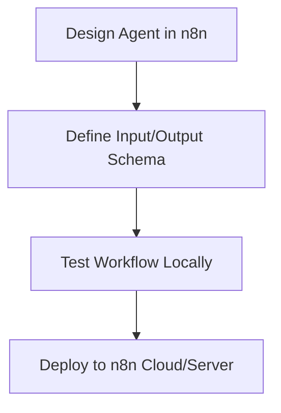
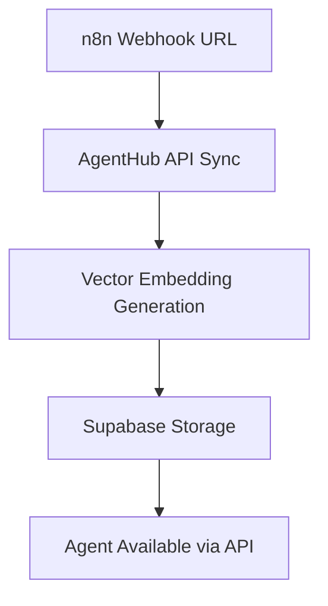
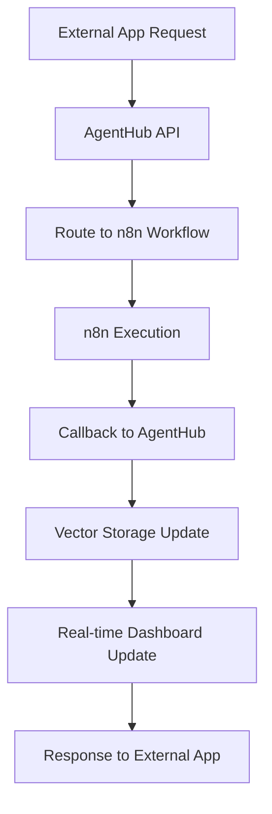

# AgentHub Technical Architecture

## 🏗️ System Overview

AgentHub is a **microservices-based agent orchestration platform** designed to bridge n8n workflow automation with intelligent agent capabilities through vector storage and real-time monitoring.

## 🎯 Core Principles

### **Separation of Concerns**
- **n8n**: Agent logic and workflow design
- **AgentHub**: Agent storage, API orchestration, and analytics  
- **External Apps**: Agent consumption and integration
- **Supabase**: Vector storage and real-time capabilities

### **API-First Design**
- RESTful API for all agent operations
- Real-time callbacks for status updates
- Standardized response formats
- Comprehensive error handling

## 🛠️ Technology Stack

### **Backend Services**
```typescript
// Core API Service (Express + TypeScript)
├── Agent Management API
├── Run Orchestration Engine  
├── n8n Integration Layer
├── Vector Storage Interface
├── Real-time Broadcasting
└── Analytics Collection
```

### **Frontend Dashboard**
```typescript
// Internal Team Interface (Next.js + TypeScript)
├── Agent Monitoring Dashboard
├── Performance Analytics
├── API Log Viewer
├── n8n Sync Management  
└── Testing Interface
```

### **Data Layer**
```sql
-- Supabase (PostgreSQL + pgvector)
├── agents (vector embeddings)
├── runs (execution tracking)
├── api_logs (request/response logs)
├── analytics (performance metrics)
└── n8n_sync (workflow definitions)
```

## 🔄 Agent Lifecycle

### **1. Agent Design (n8n)**


### **2. Agent Import (AgentHub)**


### **3. Agent Execution**


## 🚀 API Design

### **Core Endpoints**

#### **Agent Management**
```typescript
// List available agents
GET /api/agents
Response: Agent[]

// Execute specific agent
POST /api/agents/:id/run
Body: { input: any, callback_url?: string }
Response: { run_id: string, status: 'queued' }

// Get run status
GET /api/runs/:run_id
Response: { status, output?, error?, metadata }
```

#### **Webhook Callbacks**
```typescript
// n8n completion callback
POST /api/callbacks/n8n
Body: { 
  run_id: string,
  status: 'success' | 'error',
  output?: any,
  error?: string,
  duration_ms: number,
  cost_usd?: number
}
```

## 🧠 Vector Intelligence

### **Agent Embeddings**
```typescript
interface AgentEmbedding {
  agent_id: string
  embedding: number[]        // 1536-dim vector (OpenAI)
  metadata: {
    description: string
    capabilities: string[]
    input_schema: JSONSchema
    output_schema: JSONSchema
    n8n_workflow_id: string
  }
}
```

### **Intelligent Routing**
```typescript
// Future: Semantic agent selection
async function selectBestAgent(query: string): Promise<Agent> {
  const queryEmbedding = await openai.embeddings.create({
    model: "text-embedding-ada-002",
    input: query
  })
  
  const { data } = await supabase
    .rpc('match_agents', {
      query_embedding: queryEmbedding.data[0].embedding,
      match_threshold: 0.8,
      match_count: 1
    })
    
  return data[0]
}
```

## 📊 Analytics & Monitoring

### **Performance Metrics**
- **Response Time**: API → n8n → callback latency
- **Success Rate**: Percentage of successful agent executions
- **Usage Patterns**: Which agents are called most frequently
- **Error Analysis**: Categorization and trending of failures

### **Real-time Dashboard**
```typescript
// Supabase Realtime subscription
const subscription = supabase
  .channel('agent_runs')
  .on('postgres_changes', {
    event: '*',
    schema: 'public',
    table: 'runs'
  }, (payload) => {
    updateDashboard(payload)
  })
  .subscribe()
```

## 🔐 Security & Authentication

### **API Security**
- **API Keys**: Service-to-service authentication
- **Rate Limiting**: Prevent abuse and ensure fair usage
- **Request Validation**: Zod schemas for input validation
- **CORS**: Controlled cross-origin access

### **Data Privacy**
- **Row Level Security**: Supabase RLS for multi-tenant isolation
- **Encrypted Storage**: Sensitive data encryption at rest
- **Audit Logging**: Complete request/response logging
- **GDPR Compliance**: Data retention and deletion policies

## 🌐 Integration Patterns

### **Website Integration**
```javascript
// Customer website calls AgentHub
const response = await fetch('https://agenthub.api/agents/conversational/run', {
  method: 'POST',
  headers: {
    'Authorization': 'Bearer YOUR_API_KEY',
    'Content-Type': 'application/json'
  },
  body: JSON.stringify({
    input: {
      message: "Hi, I'm interested in your services",
      context: { page: '/contact', user_id: '123' }
    },
    callback_url: 'https://mysite.com/webhook/agent-complete'
  })
})

const { run_id } = await response.json()
// Poll or wait for callback...
```

### **Mobile App Integration**
```typescript
// React Native / Flutter integration
class AgentHubClient {
  async callAgent(agentId: string, input: any): Promise<string> {
    const response = await this.http.post(`/agents/${agentId}/run`, {
      input,
      callback_url: `${this.baseUrl}/mobile-callback`
    })
    return response.data.run_id
  }
  
  async getRunStatus(runId: string): Promise<RunStatus> {
    const response = await this.http.get(`/runs/${runId}`)
    return response.data
  }
}
```

## 🚀 Deployment Architecture

### **Production Infrastructure**
```yaml
# Docker Compose / Kubernetes
services:
  agenthub-api:
    image: agenthub/api:latest
    environment:
      - SUPABASE_URL
      - SUPABASE_SERVICE_KEY
      - N8N_BASE_URL
      - LANGFUSE_SECRET_KEY
    
  agenthub-dashboard:
    image: agenthub/dashboard:latest
    environment:
      - NEXT_PUBLIC_API_URL
      - NEXT_PUBLIC_SUPABASE_URL
      
  nginx:
    image: nginx:alpine
    volumes:
      - ./nginx.conf:/etc/nginx/nginx.conf
```

### **Scalability Considerations**
- **Horizontal Scaling**: Stateless API services behind load balancer
- **Database Scaling**: Supabase connection pooling and read replicas
- **Caching**: Redis for frequently accessed agent definitions
- **Queue Management**: Background job processing for long-running agents

## 🔮 Future Enhancements

### **Master Agent Coordination**
```typescript
interface MasterAgent {
  analyzeRequest(request: string): Promise<AgentPlan>
  executeAgentPlan(plan: AgentPlan): Promise<Results>
  coordinateMultipleAgents(agents: Agent[]): Promise<void>
}

// Example: "Schedule a meeting and prepare a client report"
// Master agent would:
// 1. Call Appointment Scheduler Agent
// 2. Wait for confirmation  
// 3. Call Research Agent for client data
// 4. Call Form Filling Agent for report generation
```

### **Advanced Vector Operations**
- **Semantic Search**: Find similar past executions
- **Agent Clustering**: Group agents by capability similarity  
- **Performance Prediction**: ML models for execution time/success
- **Auto-Optimization**: Self-improving agent parameters

### **Enterprise Features**
- **Multi-tenant Architecture**: Customer isolation and billing
- **SLA Monitoring**: Performance guarantees and alerting
- **Compliance Tools**: GDPR, CCPA, SOX audit trails
- **Advanced Analytics**: Business intelligence dashboards

---

## 📚 Development Resources

### **Local Development**
```bash
# Start full development environment
npm run dev

# Individual services
npm run dev:api      # Backend API only
npm run dev:dashboard # Frontend only  
npm run dev:db       # Supabase local instance
```

### **Testing Strategy**
```typescript
// Unit Tests
describe('Agent Execution', () => {
  test('should route to correct n8n workflow', async () => {
    // Test implementation
  })
})

// Integration Tests  
describe('API Integration', () => {
  test('should complete full agent execution cycle', async () => {
    // End-to-end test
  })
})
```

### **Monitoring & Observability**
- **Application Logs**: Pino structured logging
- **Performance Metrics**: Custom Prometheus metrics
- **Error Tracking**: Sentry integration
- **Uptime Monitoring**: Health check endpoints
